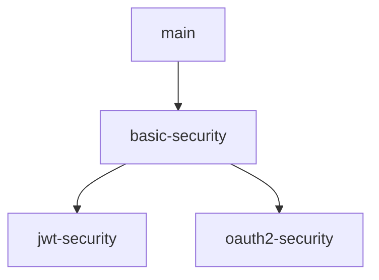

# School Management System

[](LICENSE)
[](https://spring.io/projects/spring-boot)
[](https://openjdk.org/projects/jdk/21/)

A modern school management system backend built with Spring Boot, featuring advanced JPA/Hibernate techniques, robust API documentation, and efficient data mapping.

**Note**: This project i am building so i could train on some spring boot technologies so this main branch will be the core project and every time i will train on new topic i will create a branch for it

## Project Structure

This project uses multiple branches to separate different security implementations while maintaining a stable core:



### Branches
- [](https://github.com/ziadabdelnaby10/school-management-system/tree/main)    
  Contains the foundational implementation:
  - JPA entity modeling
  - Repository interfaces
  - REST API endpoints
  - Core business logic

- [](https://github.com/ziadabdelnaby10/school-management-system/tree/basic-security)      
  Implements:
  - Spring Security with Basic Auth
  - Role-based access control
  - In-memory user credentials
  - Secured endpoints

- [](https://github.com/ziadabdelnaby10/school-management-system/tree/jwt-security)  
  Implements:
  - JWT authentication flow
  - Token generation/validation
  - Stateless security
  - Refresh token support

## Features

- **Core Management Modules**:
  - Student Management
  - Teacher Management
  - Course Management
  - Class/Section Management
  - Enrollment System
  - Academic Records Tracking

- **Advanced JPA Implementation**:
  - Base Entity with audit fields (createdAt, updatedAt)
  - Complex entity relationships (OneToMany, ManyToMany with join tables)
  - Inheritance strategies (MappedSuperclass for Person entity)
  - UUID-based identifiers using `AbstractPersistable`
  - Criteria API for dynamic query building
  - Bean Validation (Hibernate Validator)
  - Optimized JPA configuration (`spring.jpa.open-in-view=false`)

- **Technical Features**:
  - RESTful API with proper HTTP status codes
  - DTO Pattern with MapStruct mapping
  - Swagger UI API Documentation
  - Layered Architecture (Controller-Service-Repository)
  - Comprehensive exception handling
  - MySQL database integration
  - Lombok for boilerplate reduction
  - Maven build tool

## Technology Stack

- **Backend**: Spring Boot 3.4.1
- **Java Version**: 21
- **Persistence**: 
  - Spring Data JPA
  - Hibernate 6.4+
  - MySQL 8.0+
- **Mapping**: MapStruct 1.6.2
- **API Documentation**: Swagger UI 2.8.1
- **Build Tool**: Maven
- **Development Tools**: Lombok 1.18.36

## Installation & Setup

### Prerequisites
- Java 21 JDK
- MySQL 8.0+
- Maven 3.9+

### Steps
1. Clone the repository:
   ```bash
   git clone https://github.com/ziadabdelnaby10/SchoolManagementSystem.git
   ```
2. Create MySQL database:
   ```sql
   CREATE DATABASE school_management;
   ```
3. Configure database credentials in `application.properties`:
   ```properties
   spring.datasource.url=jdbc:mysql://localhost:3306/school_management
   spring.datasource.username=root
   spring.datasource.password=password
   ```
4. Build the project:
   ```bash
   mvn clean install
   ```
5. Run the application:
   ```bash
   mvn spring-boot:run
   ```

Access Swagger UI at: http://localhost:1234/swagger-ui.html

## Project Structure

```
src/
├── main/
│   ├── java/com/ziad/
│   │   ├── config/          # Configuration classes
│   │   ├── controller/      # REST Controllers
│   │   ├── dto/             # Data Transfer Objects
│   │   ├── entity/          # JPA Entities
│   │   ├── response/        # Specific responses
│   │   ├── request/         # Specific requests
│   │   ├── mapper/          # MapStruct mappers
│   │   ├── repository/      # JPA Repositories
│   │   ├── service/         # Business logic layer
│   │   └── SchoolManagementSystemApplication.java
│   └── resources/
│       └── application.properties
```

## Advanced Configuration

### JPA Settings (application.properties)
```properties
# JPA/Hibernate Configuration
spring.jpa.hibernate.ddl-auto=update
spring.jpa.show-sql=true
spring.jpa.properties.hibernate.format_sql=true
spring.jpa.open-in-view=false
```

### Base Entity Implementation
```java
@MappedSuperclass
public abstract class Person extends AbstractPersistable<UUID> {

    @Column(nullable = false, length = 45)
    private String firstName;

    @Column(nullable = false, length = 45)
    private String lastName;

    @Column(nullable = false, unique = true, length = 45)
    private String email;

    @Column
    private Boolean isMale;

    @Column(nullable = false, length = 45)
    private String password;

    @Column(length = 15)
    private String phone;

    @Column(length = 15)
    private String mobile;

    @Column
    @Temporal(TemporalType.DATE)
    private Date dateOfBirth;

    @Column
    private Boolean isActive;
}
```

### Entity Relationships Example
```java
@Entity
public class Student extends Person {

    @ManyToOne
    private StudyYear currentYear;

    @ManyToOne(fetch = FetchType.LAZY)
    @JoinColumn(name = "parent_id")
    private Parent parent;

    @OneToMany(mappedBy = "student", fetch = FetchType.LAZY)
    private Set<Attendance> attendance = new HashSet<>();

    @OneToMany(mappedBy = "student", fetch = FetchType.LAZY)
    private Set<ExamResult> examResults = new HashSet<>();

    @ManyToMany(fetch = FetchType.LAZY)
    @JoinTable(
            name = "classroom_student",
            joinColumns = @JoinColumn(name = "student_id"),
            inverseJoinColumns = @JoinColumn(name = "classroom_id")
    )
    private Set<Classroom> classrooms = new HashSet<>();

    @ManyToMany(fetch = FetchType.LAZY)
    @JoinTable(
            name = "course_student",
            joinColumns = @JoinColumn(name = "student_id"),
            inverseJoinColumns = @JoinColumn(name = "course_id")
    )
    private Set<Course> courses = new HashSet<>();
}
```

## API Documentation

The system provides comprehensive API documentation through Swagger UI:
- **Interactive Documentation**: http://localhost:1234/swagger-ui.html
- **OpenAPI JSON**: http://localhost:1234/v3/api-docs

## Upcoming Features

- Role-based Access Control (RBAC)
- Reporting & Analytics
- Caching Mechanism (Redis)
- Email Notifications
- Advanced Search with Specifications
- Security Authentication and Authorization
- Nice UI Frontend (Thymeleaf or JavaFx)

## Contributing

Contributions are welcome! Please follow these steps:
1. Fork the repository
2. Create your feature branch (`git checkout -b feature/your-feature`)
3. Commit your changes (`git commit -m 'Add some feature'`)
4. Push to the branch (`git push origin feature/your-feature`)
5. Open a Pull Request

## License

This project is licensed under the MIT License - see the [LICENSE](LICENSE) file for details.

## Acknowledgments

- Spring Boot Team
- Hibernate Community
- MySQL Development Team
- MapStruct Maintainers

---

**Note**: This project is currently in active development. Core functionality is stable, but new features are being added regularly based on frontend requirements.

[//]: # (This README includes:)

[//]: # (1. Technology badges for quick overview)

[//]: # (2. Detailed feature list highlighting advanced implementations)

[//]: # (3. Clear installation instructions)

[//]: # (4. Project structure visualization)

[//]: # (5. Code snippets for key implementations)

[//]: # (6. API documentation information)

[//]: # (7. Roadmap for future development)

[//]: # (8. Contribution guidelines)

[//]: # (9. License information)

[//]: # ()
[//]: # (You might want to:)

[//]: # (1. Add specific environment variables for production)

[//]: # (2. Include sample API requests/responses)

[//]: # (3. Add database schema diagram)

[//]: # (4. Include security configuration details once implemented)

[//]: # (5. Add testing instructions and coverage reports)

[//]: # (6. Include deployment instructions for cloud platforms)